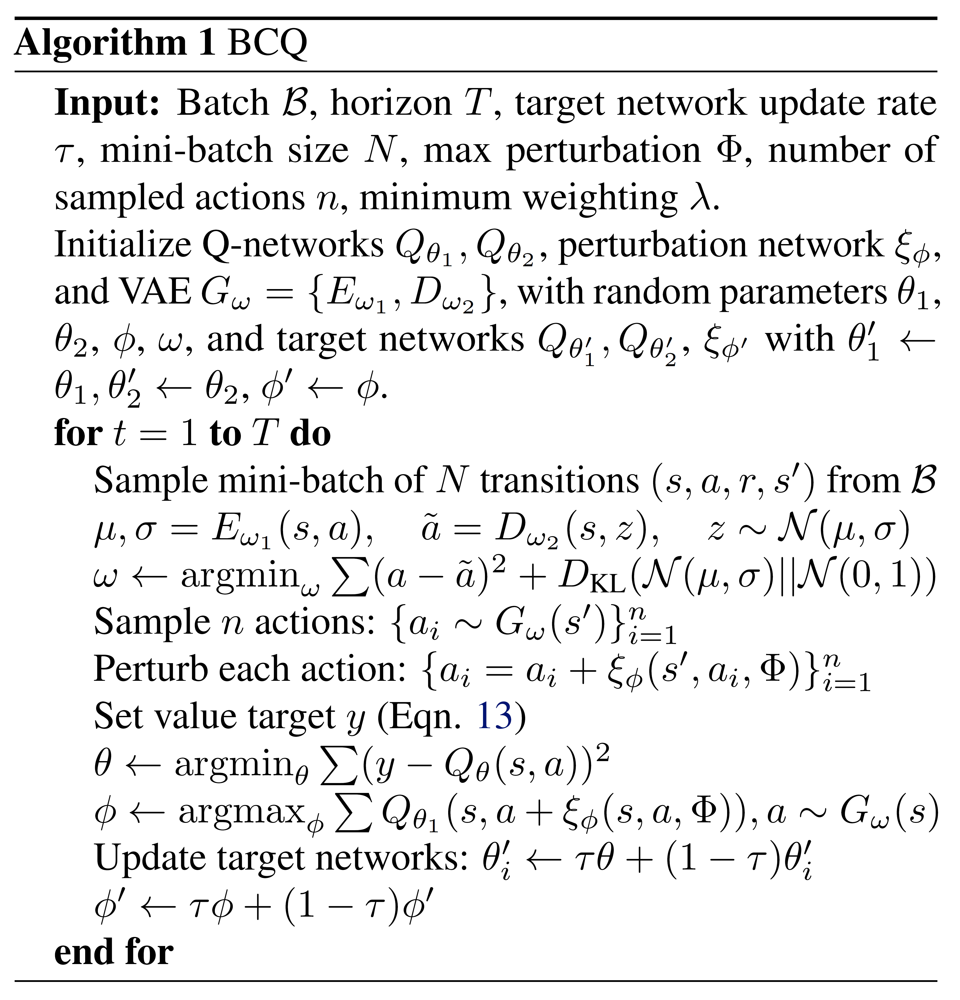
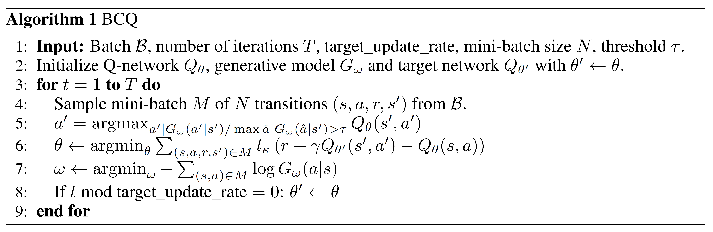

---

# 离线强化学习（一）

本文为离线强化学习系列介绍的第一部分，包括离线强化学习的简介与部分policy constraint类方法简介。本系列持续更新，欢迎大家关注交流讨论~

## 一、简介

标准的强化学习（RL）通过反复试错（trial and error）来学习如何执行任务，并在探索（exploration）与利用（exploitation）之间进行平衡以达到更好的表现。而离线强化学习（Offline Reinforcement Learning, Offline RL），又称作批量强化学习（Batch Reinforcement Learning, BRL），是强化学习的一种变体，它要求智能体（agent）从固定的一个数据集中进行学习，而不能进行探索。换句话说，Offline RL研究的是如何最大限度地利用静态的离线数据集来训练强化学习智能体。在Sergey Levine等人的综述论文[《Offline reinforcement learning: Tutorial, review, and perspectives on open problems》](https://arxiv.org/abs/2005.01643)[1]中，他们用下面这张图来描述 Offline RL与标准RL的关系与区别：

图1 在线强化学习(a)、off-policy强化学习(b)和离线强化学习(c)的图示

在上图中，图1(a)是标准的在线RL，智能体的策略$\pi_{k}$与环境进行交互，产生交互数据$\{s_{i}, a_{i}, r_{i}, s^{\prime}_{i}\}$，该数据将直接使用时间差分（Temporal Difference, TD）等方法用来更新当前的策略$\pi_{k}$，得到最新的策略$\pi_{k+1}$。图1(b)是off-policy RL，它会将过去的策略与环境交互的历史数据存储在经验池中，而在更新当前策略时则从经验池进行采样，用得到的样本进行更新。得到的策略将继续与环境交互，交互得到的数据也将存入经验池中。图1(c)是Offline RL，经验池中的离线数据由未知的行为策略（behaviour policy）产生，而离线强化学习希望利用该经验池中的这些来源未知的数据进行当前策略的学习和更新，并期望学到的策略可以在部署到交互环境中时可以有不错的表现。

### 为什么Offline RL成为了研究热点？

Offline RL成为了最近的研究热点，主要是由于两个方面的原因。

第一个原因是Offline RL的设定相比于标准RL更加安全。熟悉强化学习的同学知道，标准的RL的一个核心难点便是采样效率极低，需要频繁地与环境进行交互收集数据来训练智能体。而交互过程中大量的探索在很多现实场景会带来严重的成本损失。例如，使用机器人在真实环境中进行探索可能会有损坏机器人硬件或周围物体的风险；在广告投放中进行探索可能会导致广告主的预算白白浪费；在医疗和自动驾驶中进行探索则可能会严重危害人类的生命安全。而离线强化学习的设定是利用离线数据进行策略学习而不进行任何交互，因此避免了探索可能带来的成本损失。

第二个原因则是现有的标准RL算法在离线的设定下学习效果往往非常差，学到的策略无法在实际部署中取得令人满意的表现。那么，Offline RL的难点在哪里？从图1(b)和图1(c)的对比来看，似乎Offline RL与off-policy RL非常相似，都是用其他策略产生的数据来更新当前要学习的策略，那如果直接使用off-policy的RL方法来进行离线学习，会是什么效果呢？在Aviral Kumar等人的工作[9]中，它们尝试了使用SAC [2]算法在不同量级的专家级别离线数据上进行off-policy的学习：

图2 SAC在HalfCheetah-v2专家数据上的表现（左图累积收益，右图Q值对数）

从图2可以看到，SAC的表现堪称灾难级别的差劲，相比于数值为负的收益值，它的Q值估计出现了严重的高估情况。乍一看，这种现象类似于过拟合（Overfitting），但正如图中结果所示，增加静态数据集的大小并不能解决问题，这说明SAC在Offline RL中遇到的问题比过拟合要更复杂。熟悉强化学习的同学知道，由于探索-利用之间矛盾的存在，只利用从离线数据中学到的经验进行最优选择，可能会收敛到局部最优，而不是最优解。因此在RL的训练过程中，通常都会采用epsilon-greedy、加噪声等探索技巧，从而进行对探索-利用进行平衡。探索在帮助寻找最优解的同时，还有一个重要作用便是修正当前策略对于<状态，动作>对的$Q$值的估计，避免对于不熟悉的<状态，动作>对产生高估。因此，离线学习的设定下，off-policy算法无法进行探索，所以会产生严重的高估现象。深入来说，离线学习设定下产这个问题的根本原因其实是分布变化（Distributional Shift）带来的：虽然我们的函数逼近器（策略、价值函数或模型）会在一种离线数据的分布下进行训练，但训练得到的策略在与环境进行交互时，访问的状态与离线数据相比可能产生了变化。由于Q函数逼近器只对来自与其离线训练数据相同分布的输入是可靠的，对于实际交互中访问到的<状态，动作>对，$Q$函数的估值极有可能是不准确的。如果Q函数高估了这些训练数据中未曾见过的<状态，动作>对，那么在实际交互中，当智能体选择最大化预期回报（$Q$值）的动作时，便可能选到实际收益非常差的动作，导致整体的表现非常差。我们称这些数据集分布之外的动作为分布外（out-of-distribution , **OOD**）的动作。

为了解决Distributional Shift的问题，学术界开始在现有的off-policy  RL算法基础之上，进行Offline RL算法的研究。参照在综述论文[1]的说法，我们称这类算法为基于Approximate Dynamic Programming的Offline Reinforcement Learning 算法。我们的Offline RL系列也将主要介绍这类方法。另一类基于Importance Sampling的Offline RL 算法不会在此系列中重点介绍。 

### Offline RL与模仿学习有什么区别？

Offline RL与模仿学习(Imitation Learning, IL)密切相关，因为后者也从固定的离线数据集进行学习，而不进行探索。但是它们之间有几个关键的区别[3]

* 现有的一些Offline RL算法建立在标准的off-policy RL算法之上，这些算法倾向于优化某种形式的Bellman方程或TD差分误差；而IL算法则更多是监督学习技巧的利用（也有一些工作结合了强化学习的优化方法）
* 大多数IL问题假设有一个最优的或一个高性能的专家来提供数据；而Offline RL可能需要从次优的数据中进行学习
* 大多数IL问题没有奖励（reward）的概念；而Offline RL需要显式考虑reward
* 一些IL问题要求数据被标记为专家经验和非专家经验，而Offline RL不做这个假设

### Offline RL算法有哪些？

遵循Aviral Kumar与Sergey Levine在[NeurIPS 2020 Tutorial](https://sites.google.com/view/offlinerltutorial-neurips2020/home)中的分类方式，我们将现有的Offline RL算法分为如下四大类：

* Policy Constraint Methods

* Value Function Regularization Methods

* Model-based Methods

* Uncertainty-based Methods

接下来我们从Policy Constraint Methods开始介绍。

## 二、Policy Constraint Methods

### 2.1 BCQ-Continuous: Off-Policy Deep Reinforcement Learning Without Exploration

这篇文章[4]的作者是大名鼎鼎的TD3 [5]的作者Scott Fujimoto。他在这篇工作中提出一个观点：当只通过离线数据进行学习的时候，由于外推误差（extrapolation error）的存在，深度RL中的大多数off-policy算法都将失败。这是由于离线数据之外的<状态，动作>对$(s,a)$可能具有不准确的$Q$值，这将对依赖于传播这些值的算法产生不利影响。在标准的在线学习中，采用探索可以纠正这些误差，因为智能体可以得到得到真实的奖励值来对不同的$(s,a)$进行$Q$值估计的修正，但在离线的设定下off-policy的RL缺乏这种纠错能力。

为了验证这个观点，Fujimoto设计了一个实验。他训练一个DDPG作为行为策略$\pi_{\beta}$（生成静态数据的策略），用它来为Offline RL生成离线数据。实验内容包括：

* Final Buffer：将行为策略$\pi_{\beta}$的智能体在线训练100万步（包含探索），并将训练期间产生的所有交互数据存到一个经验池中。然后从头开始训练一个新的DDPG智能体$\pi$，训练时只使用经验池中的数据，自己不进行探索。
* Concurrent：当行为策略$\pi_{\beta}$在线训练100万步（包含探索）时，在$\pi_{\beta}$的经验池数据上并行地训练一个新的DDPG智能体$\pi$，
  同样，这个新的智能体的也不进行探索。在整个学习过程中，这两个智能体具有相同的经验池。
* Imitation Learning：训练行为策略$\pi_{\beta}$，直到它足够好，然后运行它100万步，将采样得到的数据存入经验池中。与Final Buffer的不同之处在于，这100万步都来自于同一个固定的策略，而Final Buffer存的数据则包含了这100万步中变化的策略所得到的交互数据。

令人惊讶的是，即使在Concurrent设置中，新的DDPG agent也不能学到一个很好的策略。训练过程中主要的区别可能在于：（1） 初始策略的随机性；（2）mini batch采样中的噪声。这说明不同初始策略的状态分布差异所导致的外推误差，已经足够对于策略的表现产生非常大的影响。

为了缓解外推误差带来的影响，本文提出了Batch Constrained deep Q-learning (BCQ)算法。由于Fujimoto在本工作之后还提出了针对离散动作空间的BCQ算法，因此这里我们称这篇针对连续动作空间的BCQ为BCQ-Continuous。BCQ-Continuous的设计是进行正常的Q-learning，但在选取最大化$Q$值对应的动作的步骤时，希望只考虑实际出现在这批离线数据中中的动作$a$，而不是考虑动作空间中所有可能的动作。换句话说，是让学习的策略不要采取行为策略$\pi_{b}$不太可能选择的动作。

具体来说，BCQ-Continuous训练一个生成模型（VAE）来生成可能来自离线数据的动作（即重建行为策略），以及进一步干扰动作的扰动模型（Perturbation network）对生成的动作进行调优。在测试时，他们首先通过生成模型采样$N$个动作，对每个动作进行扰动，然后选择值最高的动作。具体的算法如下图所示：

图3 BCQ-Continuous算法流程图

在Fujimoto自己实现的版本中，它在DDPG的架构上进行了修改，将actor的输入由state变为state与action，将actor作为了图3中提到的扰动模型（如图4红框内容所示），并没有额外引入一个单独的模型：

图4 BCQ-Continuous算法训练代码

Fujimoto在Final Buffer/Concurrent/Imitation Learning三种设定下用BCQ进行了实验，发现BCQ的效果都很好，超过了传统的off-policy算法以及一些模仿学习算法，在一些环境上甚至还超过了行为策略的表现。虽然这些行为策略的表现都算不上专家级别，但是这些结果还是证明了Offline RL相比于模仿学习的独特优势以及巨大的潜力。同时，它简单有效的思想便于复现，在我自己的实验中，BCQ在D4RL数据集 [8]上的表现比大多数后续的Offline RL工作都稳定和优秀：

图5 BCQ-Continuous在D4RL部分环境上的效果

### 2.2 BCQ-Discrete: Benchmarking Batch Deep Reinforcement Learning Algorithms

在Fujimoto的撰写的这篇NeurIPS 2019 workshop论文[6]中，他提出了针对离散动作空间的BCQ：

图6 BCQ-Discrete算法流程图

BCQ-Discrete的整体思路和BCQ-Continuous是一致的，主要的区别是BCQ-Discrete在重建行为策略的时候无需训练VAE这种较为复杂的生成模型，只要使用标准的监督学习的方式来训练一个行为克隆（behaviour cloning）网络$G_{\omega}(a \mid s) \approx \pi_{b}(a \mid s)$来作为行为策略即可。同时在进行Q-learning时，对于第$k$轮迭代上的$Q$函数更新，将动作空间中选取最大化$Q$值的动作改为只考虑相对可能性$\frac{G_\omega(a'|s')}{\max \hat{a} \; G_\omega(\hat{a}|s')}$大于阈值的动作：
$$
\mathcal{L}(\theta) = \ell_k \left(r + \gamma \cdot \Bigg( \max_{a' \; \mbox{s.t.} \; \frac{G_\omega(a'|s')}{\max \hat{a} \; G_\omega(\hat{a}|s')} > \tau} Q_{\theta'}(s',a') \Bigg) - Q_\theta(s,a) \right)
$$
在测试时执行策略时，可以使用类似的阈值：

$$
\pi(s) = \operatorname*{argmax}_{a \; \mbox{s.t.} \; \frac{G_\omega(a'|s')}{\max \hat{a} \; G_\omega(\hat{a}|s')} > \tau} Q_\theta(s,a)
$$
我们可以对参数$\tau$进行调整。当$\tau=0$时，它就是简单的标准Q-learning，因为从生成模型得到的任何动作都应该有非零概率。当$\tau=1$时，这便是标准的行为克隆，因为策略选择行为只会考虑$G_{\omega}$值最高的动作，而忽略了它的$Q$值。根据附录，BCQ-Discrete使用的$\tau=0.3$。

这篇论文的实验是在九个Atari游戏上进行的。离线数据是使用经过部分训练（超过10M步）的DQN智能体（以50M步为标准）与环境交互得到的。因为策略是固定的，Fujimoto在产生数据时加入了噪声，加噪声的方式是在80%的 episode中将$\epsilon$设置为0.2，其余episode设置为0.001。BCQ-Discrete在这些数据上取得了比DQN、QR-DQN和REM等标准的off- policy算法更好的效果。不过一个有趣的结论是，当离线数据足够丰富且多样时，QR-DQN表现也非常好，这也印证了另一篇论文REM [7]的说法，该论文认为当离线数据足够充足时，只要off-policy算法的利用（exploitation）能力足够强，便足够学到一个很好的策略。关于REM这篇论文的详细介绍我们会在本系列之后的篇章里介绍。

### 2.3 Stabilizing Off-Policy Q-Learning via Bootstrapping Error Reduction

Aviral Kumar的这篇NeurIPS 2019论文与之前Fujimoto的BCQ论文高度相关，因为它的思路也是在off-policy方式运行Q-learning时限制动作的分布。它提出了一个概念，即bootstrapping error，在本文的摘要中对bootstrapping error描述为：

>  We identify bootstrapping error as a key source of instability in current methods. Bootstrapping error is due to bootstrapping from actions that lie outside of the training data distribution, and it accumulates via the Bellman backup operator. We theoretically analyze bootstrapping error, and demonstrate how carefully constraining action selection in the backup can mitigate it.

那么这里的bootstrapping error和Fujimoto在BCQ中提到的外推误差有什么区别？我认为这两个术语都可以用来指在Q-learning过程中传播不准确的$Q$值的问题。其中外推误差是在监督学习中的一个更广泛的问题，而bootstrapping是依靠bootstrap估计进行的强化学习算法中出现的特定问题。Kumar有一篇[BAIR](https://bair.berkeley.edu/blog/2019/12/05/bear/)博客文章[10]，它对bootstrapping error如何影响静态数据上的offline Q-learning提供了很好的直觉解释。例如，图7的右图中，红色虚线表示由行为策略$\pi_{\beta} (a|s)$得到的动作分布。在测试中，我们可能访问到蓝色实线表示的行为策略动作分布之外的动作。如果$Q$认为错误地高估这些动作的$Q(s,a)$值（如红色圈中的OOD动作对应的$Q$值就非常高），那么它们就会被用于Q-learning的bootstrapping过程中，成为Q-learning更新的目标，引起bootstrapping error的累积。

图7 OOD动作的高Q值不准确，可能用于贝尔曼迭代，导致误差的累积

针对bootstrapping error，这篇论文做了两个主要贡献: (a)理论分析了在Q-learning过程中约束动作可以减少误差传播；(b)设计了一个实际的算法，称为Bootstrapping Error Accumulation Reduction (BEAR) [9]。

BEAR认为BCQ要求学习到的策略与行为策略分布接近的方式（distribution-matching constraint）类似于类似行为克隆（behavior cloning），对于行为策略水平较高的数据集还比较合理，但是如果离线数据是由中等水平甚至随机的行为策略产生的，这样严格的约束反而限制了策略进步的空间。BEAR算法的想法是不限制学习到的策略与离线数据所反应的行为策略的分布接近，而只要求学习到的策略对行为策略密度不可忽略的动作给予非零的概率即可，BEAR将其称为support constraint。如图8右边子图所示，假设行为策略（红色虚线）是均匀地随机采样动作，那么support constraint会有潜力学习到一个接近确定的最优策略（假设最优策略是某一个黄色实线表示的确定性策略）。而图8中间子图中，distribution-matching约束则会导致学习到的策略也只能是一个接近随机的策略（某一个紫色实线）。这种现象背后的理论简单来说就是，support constraint使我们能够通过学习策略的上界集中性来控制误差传播，同时减少与最优策略的散度。详细的理论分析可以参照作者的论文。

图8 support constraint与distribution-matching constraint区别

在实践中，BEAR使用了最大平均差异(MMD)距离来近似衡量support divergence。对于向量$X=\left\{x_{1}, \cdots, x_{n}\right\}, Y=\left\{y_{1}, \cdots, y_{n}\right\}$，对于任意的kernel $k$，MMD的定义为：
$$
\operatorname{MMD}^{2}(X, Y)=\frac{1}{n^{2}} \sum_{i, i^{\prime}} k\left(x_{i}, x_{i^{\prime}}\right)-\frac{2}{n m} \sum_{i, j} k\left(x_{i}, y_{j}\right)+\frac{1}{m^{2}} \sum_{j, j^{\prime}} k\left(y_{j}, y_{j^{\prime}}\right)
$$
假设kenrel $k$为gaussian kernel，那么MMD的计算方式可以用图9中的方式进行计算：

图9 MMD计算代码

可以认为MMD衡量的是学习到的策略$\pi$的动作与未知的行为策略的$\pi_{\beta}$动作分布之间的距离。因此本文针对actor-critic算法的policy improvement步骤可以表示为：
$$
\pi_{\phi}:=\max _{\pi \in \Delta|S|} \mathbb{E}_{s \sim \mathcal{D}} \mathbb{E}_{a \sim \pi(\cdot \mid s)}\left[\min _{j=1, \ldots, K} \hat{Q}_{j}(s, a)\right] \quad \text { s.t. } \quad \mathbb{E}_{s \sim \mathcal{D}}[\operatorname{MMD}(\mathcal{D}(\cdot \mid s), \pi(\cdot \mid s))] \leq \varepsilon
$$
其中$D$表示行为策略$\pi_{\beta}$收集的离线静态数据，$j$下标来自ensemble的$Q$函数集合，用于计算$Q$值的保守估计值。

BEAR的整体算法则如图10所示：

那么相比于BCQ，BEAR的效果如何呢？如图11所示，可以看到，BCQ通常在由专家策略收集的数据上更好，但是BEAR在由较弱的甚至是随机的策略收集的数据上效果更好。

图11 BEAR在随机策略数据（上）与专家策略数据（下）的表现

值得一提的有两点：

* 本文没有消融实验对比只使用一个或两个$Q$网络进行测试的效果，所以$Q$网络的ensemble和MMD约束哪个更重要我们并不清楚。

* 在BRAC+的论文[11]（ICLR 2021投稿，评分7755被拒）以及我自己的实验中发现，BEAR在某些环境（如hopper-expert-v0）上持续训练时，效果会变得越来越差（BEAR源代码与自己实现的版本都有同样的现象）：

  

图12 BEAR在D4RL部分环境上的效果

## 参考

1. Levine S, Kumar A, Tucker G, et al. Offline reinforcement learning: Tutorial, review, and perspectives on open problems[J]. arXiv preprint arXiv:2005.01643, 2020.
2. Haarnoja T, Zhou A, Abbeel P, et al. Soft actor-critic: Off-policy maximum entropy deep reinforcement learning with a stochastic actor[C]//International conference on machine learning. PMLR, 2018: 1861-1870.
3. [Daniel Seita's Blog](https://danieltakeshi.github.io/2020/06/28/offline-rl/)
4. Fujimoto S, Meger D, Precup D. Off-policy deep reinforcement learning without exploration[C]//International Conference on Machine Learning. PMLR, 2019: 2052-2062.
5. Fujimoto S, Hoof H, Meger D. Addressing function approximation error in actor-critic methods[C]//International Conference on Machine Learning. PMLR, 2018: 1587-1596.
6. Fujimoto S, Conti E, Ghavamzadeh M, et al. Benchmarking Batch Deep Reinforcement Learning Algorithms//NeurIPS 2019 workshop.
7. Agarwal R, Schuurmans D, Norouzi M. An optimistic perspective on offline reinforcement learning[C]//International Conference on Machine Learning. PMLR, 2020: 104-114.
8. Fu J, Kumar A, Nachum O, et al. D4rl: Datasets for deep data-driven reinforcement learning[J]. arXiv preprint arXiv:2004.07219, 2020.
9. Kumar A, Fu J, Soh M, et al. Stabilizing Off-Policy Q-Learning via Bootstrapping Error Reduction[J]. Advances in Neural Information Processing Systems, 2019, 32: 11784-11794.
10. [Data-Driven Deep Reinforcement Learning](https://bair.berkeley.edu/blog/2019/12/05/bear/)
11. Zhang C, Kuppannagari S R, Prasanna V. BRAC+: Going Deeper with Behavior Regularized Offline Reinforcement Learning[J]. 2020.

